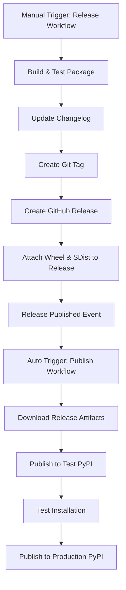

# Workflow Split: Release and Publish

This document explains the split of the previous `release.yml` workflow into two separate workflows for better separation of concerns and security.

## Overview

The previous single workflow has been split into:

1. **Release Workflow** (`release.yml`) - Creates releases and builds packages
2. **Publish Workflow** (`publish.yml`) - Publishes packages to PyPI repositories

## Workflow 1: Release (`release.yml`)

### Trigger

- Manual trigger via `workflow_dispatch`
- Requires version input (e.g., "1.0.0")
- Optional inputs for prerelease and force_recreate

### Responsibilities

- ✅ Validate version format
- ✅ Run quality checks (lint, type-check, security-check)
- ✅ Run tests with coverage
- ✅ Build package (wheel and sdist)
- ✅ Verify package integrity
- ✅ Update CHANGELOG.md with git-cliff
- ✅ Create git tag and push to repository
- ✅ Generate release notes from changelog
- ✅ Create GitHub release with artifacts attached

### Outputs

- Git tag (e.g., `v1.0.0`)
- GitHub release with wheel and sdist files attached
- Updated CHANGELOG.md committed to main branch

### Permissions Required

- `contents: write` - For creating tags and pushing commits
- `pull-requests: write` - For potential PR operations

## Workflow 2: Publish (`publish.yml`)

### Trigger

- Automatic trigger when a release is `published`
- Uses the `release` event type

### Responsibilities

- ✅ Download release artifacts (wheel and sdist) from the GitHub release
- ✅ Verify package integrity with twine
- ✅ Publish to Test PyPI first
- ✅ Test installation from Test PyPI
- ✅ Verify the installed package works
- ✅ Publish to production PyPI
- ✅ Provide publication verification links

### Security Features

- Downloads artifacts from the release (ensuring they match what was tested)
- Tests installation from Test PyPI before publishing to production
- Uses trusted publishing with OIDC tokens
- Separate environment configuration for PyPI access

### Permissions Required

- `contents: read` - For downloading release artifacts
- `id-token: write` - For trusted publishing to PyPI

## Workflow Interaction

## Benefits of This Split

### 1. **Separation of Concerns**

- Release workflow focuses on building and creating releases
- Publish workflow focuses solely on PyPI publication

### 2. **Enhanced Security**

- PyPI secrets are only used in the publish workflow
- Release workflow doesn't need PyPI access
- Publish workflow uses artifacts from the release (ensuring consistency)

### 3. **Better Error Handling**

- If publication fails, the release still exists and can be republished
- Clearer separation between build failures and publication failures

### 4. **Flexibility**

- Releases can be created without automatic publication
- Publications can be retried independently
- Draft releases can be created for testing

### 5. **Audit Trail**

- Clear separation between what was built (release) and what was published
- GitHub release artifacts serve as the source of truth

## Environment Configuration

### Release Workflow

- No special environment needed
- Uses standard GitHub token for repository operations

### Publish Workflow

- Environment: `pypi`
- Required secrets:
  - `TEST_PYPI_API_TOKEN` - For Test PyPI publication
  - `PYPI_API_TOKEN` - For production PyPI publication

## Usage

### Creating a Release

1. Go to GitHub Actions
2. Select "Release" workflow
3. Click "Run workflow"
4. Enter version (e.g., "1.0.0")
5. Optionally mark as prerelease
6. The workflow will:
   - Build and test the package
   - Create a release with artifacts
   - This will automatically trigger the publish workflow

### Publication Process

- Happens automatically when a release is published
- Can be monitored in the GitHub Actions tab
- Provides verification links at the end

## Error Recovery

### If Release Workflow Fails

- Fix the issue and re-run with `force_recreate: true`
- This will remove any partial tag/release and start fresh

### If Publish Workflow Fails

- The release still exists with artifacts
- Re-trigger by editing and re-publishing the release
- Or manually download artifacts and publish using pixi commands

## Migration Notes

### Changes Made

1. Removed PyPI publication steps from `release.yml`
2. Created new `publish.yml` workflow
3. Updated permissions and environment configurations
4. Added artifact download and verification steps
5. Enhanced error handling and testing

### Secrets Required

Ensure these secrets are configured in the repository:

- `RELEASE_PAT` - Personal access token for release operations
- `TEST_PYPI_API_TOKEN` - API token for Test PyPI
- `PYPI_API_TOKEN` - API token for production PyPI

### Environment Setup

Configure the `pypi` environment in repository settings with:

- Protection rules if desired
- Required reviewers if needed
- Environment secrets for PyPI tokens
